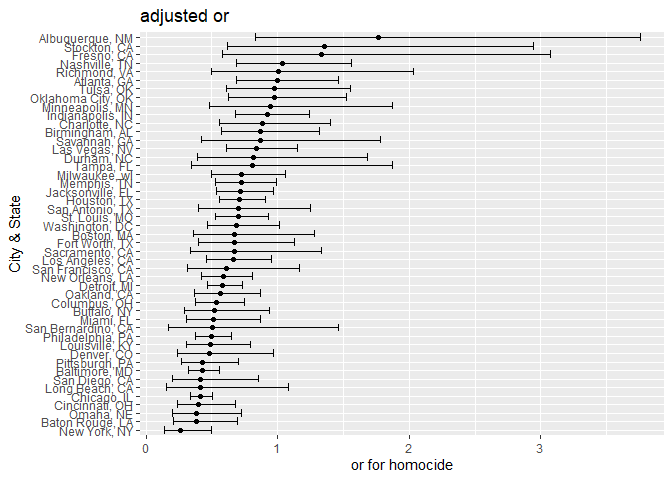
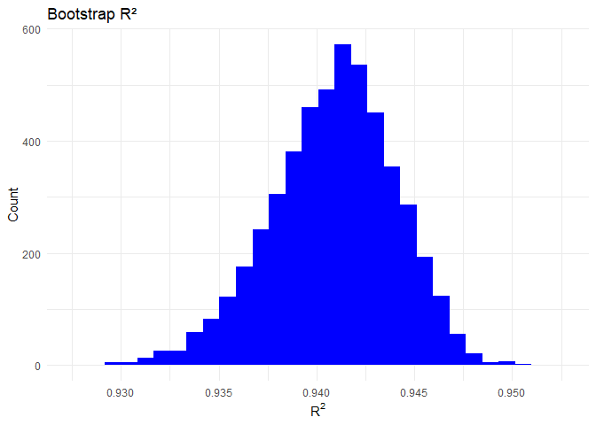
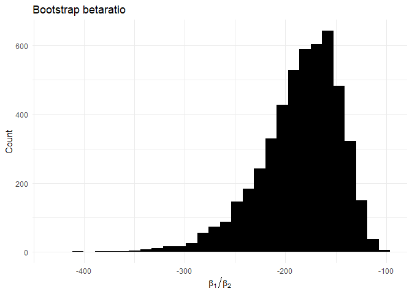
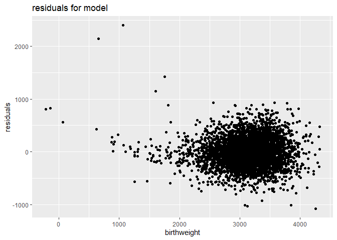
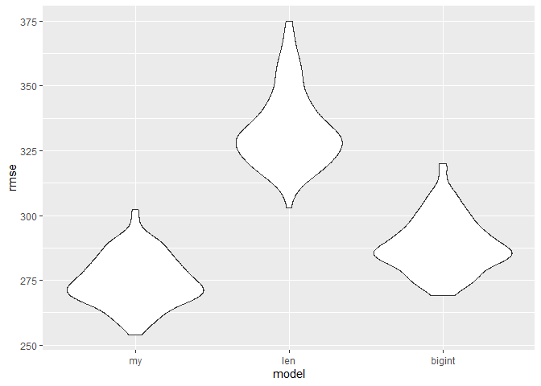

p8105_tw3108_hw6
================
Tao Wu
2025-12-03

``` r
library(tidyverse)
library(broom)
library(readr)
library(ggplot2)
data <- read_csv("data/homicide-data.csv")
new = data %>% 
  mutate(
   city_state = str_c(city, state, sep = ", "),
   check = if_else(disposition == "Closed by arrest", 1, 0),
   victim_age = as.numeric(victim_age)
  ) %>% 
  filter(!city_state %in% c("Dallas, TX","Phoenix, AZ","Kansas City, MO","Tulsa, AL")
  ) %>% 
  filter(victim_race %in% c("White", "Black"))
baltimore = new %>% 
  filter(city_state == "Baltimore, MD")
model = glm(check ~ victim_age + victim_sex + victim_race, data = baltimore, family = binomial()
 )
tidymodel = broom::tidy(model)
or = tidymodel %>%
  filter(term == "victim_sexMale") %>%
  mutate(
    or = exp(estimate),
    conf.low = exp(estimate - 1.96 * std.error),
    conf.high= exp(estimate + 1.96 * std.error)
  ) %>%
  select(term, or, conf.low, conf.high)
or
```

    ## # A tibble: 1 × 4
    ##   term              or conf.low conf.high
    ##   <chr>          <dbl>    <dbl>     <dbl>
    ## 1 victim_sexMale 0.426    0.325     0.558

``` r
cityor = new %>% 
  group_by(city_state) %>% 
  nest() %>% 
  mutate(
    model = map(data, ~ glm( check ~ victim_age + victim_sex + victim_race, data = .x, family = binomial()
  )
  ),
    result = map(model, ~ broom::tidy(.x))
  ) %>% 
  unnest(result) %>% 
  filter(term == "victim_sexMale") %>% 
  mutate(
    or       = exp(estimate),
    conf.low = exp(estimate - 1.96 * std.error),
    conf.high= exp(estimate + 1.96 * std.error)
  ) %>% 
  select(city_state, or, conf.low, conf.high) %>% 
  ungroup()
cityor
```

    ## # A tibble: 47 × 4
    ##    city_state         or conf.low conf.high
    ##    <chr>           <dbl>    <dbl>     <dbl>
    ##  1 Albuquerque, NM 1.77     0.831     3.76 
    ##  2 Atlanta, GA     1.00     0.684     1.46 
    ##  3 Baltimore, MD   0.426    0.325     0.558
    ##  4 Baton Rouge, LA 0.381    0.209     0.695
    ##  5 Birmingham, AL  0.870    0.574     1.32 
    ##  6 Boston, MA      0.674    0.356     1.28 
    ##  7 Buffalo, NY     0.521    0.290     0.935
    ##  8 Charlotte, NC   0.884    0.557     1.40 
    ##  9 Chicago, IL     0.410    0.336     0.501
    ## 10 Cincinnati, OH  0.400    0.236     0.677
    ## # ℹ 37 more rows

``` r
cityplot = cityor %>% 
  ggplot(aes(x = or, y = reorder(city_state, or))) +
  geom_point() +
  geom_errorbarh(aes(xmin = conf.low, xmax = conf.high)) +
  labs(
    x = "or for homocide",
    y = "City & State",
    title = "adjusted or"
  )
cityplot
```

<!-- -->

Problem1: In most cities, the or is close to 1, indicating that in most
cases the clearance rate for male victims is similar to female victims.
A few cities show higher or estimates, but with much wide CI, suggesting
that these cities have small sample sizes or limited number of
clearances. Overall, there is not enough evidence in most cities to show
a significant difference in clearance rates between male and female
victims.

``` r
library(p8105.datasets)
library(tidyverse)
library(modelr)
library(broom)
data("weather_df")
set.seed(1234)
boot = weather_df %>%
  modelr::bootstrap(n = 5000)
  model1 = boot %>%
  mutate(
    model = map(strap, \(df) lm(tmax ~ tmin + prcp, data = df)),
    glancedata = map(model, \(m) broom::glance(m)),
    tidydata   = map(model, \(m) broom::tidy(m))
  )
boot
```

    ## # A tibble: 5,000 × 2
    ##    strap                  .id  
    ##    <list>                 <chr>
    ##  1 <resample [2,190 x 6]> 0001 
    ##  2 <resample [2,190 x 6]> 0002 
    ##  3 <resample [2,190 x 6]> 0003 
    ##  4 <resample [2,190 x 6]> 0004 
    ##  5 <resample [2,190 x 6]> 0005 
    ##  6 <resample [2,190 x 6]> 0006 
    ##  7 <resample [2,190 x 6]> 0007 
    ##  8 <resample [2,190 x 6]> 0008 
    ##  9 <resample [2,190 x 6]> 0009 
    ## 10 <resample [2,190 x 6]> 0010 
    ## # ℹ 4,990 more rows

``` r
rsqdata = model1 %>%
  select(.id, glancedata) %>%
  unnest(glancedata) %>%
  select(.id, r.squared)
rsqdata
```

    ## # A tibble: 5,000 × 2
    ##    .id   r.squared
    ##    <chr>     <dbl>
    ##  1 0001      0.943
    ##  2 0002      0.944
    ##  3 0003      0.936
    ##  4 0004      0.932
    ##  5 0005      0.944
    ##  6 0006      0.938
    ##  7 0007      0.944
    ##  8 0008      0.936
    ##  9 0009      0.938
    ## 10 0010      0.934
    ## # ℹ 4,990 more rows

``` r
betaratio = model1 %>%
  select(.id, tidydata) %>%
  unnest(tidydata) %>%
  group_by(.id) %>%
  summarize(
      ratio = { 
      b1 = estimate[term == "tmin"] 
      b2 = estimate[term == "prcp"]   
      b1 / b2               
    }
  )
result = rsqdata %>%
  inner_join(betaratio, by = ".id")
result
```

    ## # A tibble: 5,000 × 3
    ##    .id   r.squared ratio
    ##    <chr>     <dbl> <dbl>
    ##  1 0001      0.943 -124.
    ##  2 0002      0.944 -279.
    ##  3 0003      0.936 -149.
    ##  4 0004      0.932 -173.
    ##  5 0005      0.944 -155.
    ##  6 0006      0.938 -139.
    ##  7 0007      0.944 -247.
    ##  8 0008      0.936 -265.
    ##  9 0009      0.938 -177.
    ## 10 0010      0.934 -225.
    ## # ℹ 4,990 more rows

``` r
rsqplot = result %>%
  ggplot(aes(x = r.squared)) +
  geom_histogram(bins = 30, fill = "blue") +
  labs(
    title = "Bootstrap R²",
    x = expression(R^2),
    y = "Count"
  ) +
  theme_minimal()
rsqplot
```

<!-- -->

``` r
betaplot = result %>%
  ggplot(aes(x = ratio)) +
  geom_histogram(bins = 30, fill = "black") +
  labs(
    title = "Bootstrap betaratio",
    x = expression(beta[1] / beta[2]),
    y = "Count"
  ) +
  theme_minimal()
betaplot
```

<!-- -->

``` r
bootci = result %>%
  summarize(
    rsqlow   = quantile(r.squared, 0.025),
    rsqhigh  = quantile(r.squared, 0.975),
    ratiolow = quantile(ratio, 0.025),
    ratiohigh= quantile(ratio, 0.975)
  )
bootci
```

    ## # A tibble: 1 × 4
    ##   rsqlow rsqhigh ratiolow ratiohigh
    ##    <dbl>   <dbl>    <dbl>     <dbl>
    ## 1  0.934   0.947    -281.     -126.

``` r
library(readr)
library(tidyverse)
library(modelr) 
birth <- read_csv("data/birthweight.csv")
glimpse(birth)
```

    ## Rows: 4,342
    ## Columns: 20
    ## $ babysex  <dbl> 2, 1, 2, 1, 2, 1, 2, 2, 1, 1, 2, 1, 2, 1, 1, 2, 1, 2, 2, 2, 1…
    ## $ bhead    <dbl> 34, 34, 36, 34, 34, 33, 33, 33, 36, 33, 35, 35, 35, 36, 35, 3…
    ## $ blength  <dbl> 51, 48, 50, 52, 52, 52, 46, 49, 52, 50, 51, 51, 48, 53, 51, 4…
    ## $ bwt      <dbl> 3629, 3062, 3345, 3062, 3374, 3374, 2523, 2778, 3515, 3459, 3…
    ## $ delwt    <dbl> 177, 156, 148, 157, 156, 129, 126, 140, 146, 169, 130, 146, 1…
    ## $ fincome  <dbl> 35, 65, 85, 55, 5, 55, 96, 5, 85, 75, 55, 55, 75, 75, 65, 75,…
    ## $ frace    <dbl> 1, 2, 1, 1, 1, 1, 2, 1, 1, 2, 1, 1, 1, 1, 1, 2, 1, 1, 1, 2, 1…
    ## $ gaweeks  <dbl> 39.9, 25.9, 39.9, 40.0, 41.6, 40.7, 40.3, 37.4, 40.3, 40.7, 4…
    ## $ malform  <dbl> 0, 0, 0, 0, 0, 0, 0, 0, 0, 0, 0, 0, 0, 0, 0, 0, 0, 0, 0, 0, 0…
    ## $ menarche <dbl> 13, 14, 12, 14, 13, 12, 14, 12, 11, 12, 13, 12, 13, 11, 12, 1…
    ## $ mheight  <dbl> 63, 65, 64, 64, 66, 66, 72, 62, 61, 64, 67, 62, 64, 68, 62, 6…
    ## $ momage   <dbl> 36, 25, 29, 18, 20, 23, 29, 19, 13, 19, 23, 16, 28, 23, 21, 1…
    ## $ mrace    <dbl> 1, 2, 1, 1, 1, 1, 2, 1, 1, 2, 1, 1, 1, 1, 1, 2, 1, 1, 1, 2, 1…
    ## $ parity   <dbl> 3, 0, 0, 0, 0, 0, 0, 0, 0, 0, 0, 0, 0, 0, 0, 0, 0, 0, 0, 0, 0…
    ## $ pnumlbw  <dbl> 0, 0, 0, 0, 0, 0, 0, 0, 0, 0, 0, 0, 0, 0, 0, 0, 0, 0, 0, 0, 0…
    ## $ pnumsga  <dbl> 0, 0, 0, 0, 0, 0, 0, 0, 0, 0, 0, 0, 0, 0, 0, 0, 0, 0, 0, 0, 0…
    ## $ ppbmi    <dbl> 26.27184, 21.34485, 23.56517, 21.84508, 21.02642, 18.60030, 1…
    ## $ ppwt     <dbl> 148, 128, 137, 127, 130, 115, 105, 119, 105, 145, 110, 115, 1…
    ## $ smoken   <dbl> 0.000, 0.000, 1.000, 10.000, 1.000, 0.000, 0.000, 0.000, 0.00…
    ## $ wtgain   <dbl> 29, 28, 11, 30, 26, 14, 21, 21, 41, 24, 20, 31, 23, 21, 24, 2…

``` r
birthclean <- birth %>%
  mutate(  babysex = factor(babysex, levels = c(1, 2), labels = c("male", "female")),
           
    mrace = factor(mrace, levels = c(1, 2, 3, 4, 8),labels = c("White", "Black", "Asian", "PuertoRican", "Other")),
    
    frace = factor(frace, levels = c(1, 2, 3, 4, 8, 9), labels = c("White", "Black", "Asian","PuertoRican", "Other", "Unknown")),
    
    malform = factor(malform,levels = c(0, 1), labels = c("absent", "present"))
  )
model <- lm(bwt ~ blength + gaweeks + bhead + babysex + mrace + ppbmi + smoken + wtgain + momage + parity, data = birthclean)
summary(model)
```

    ## 
    ## Call:
    ## lm(formula = bwt ~ blength + gaweeks + bhead + babysex + mrace + 
    ##     ppbmi + smoken + wtgain + momage + parity, data = birthclean)
    ## 
    ## Residuals:
    ##      Min       1Q   Median       3Q      Max 
    ## -1077.17  -186.30    -4.32   177.67  2398.08 
    ## 
    ## Coefficients:
    ##                    Estimate Std. Error t value Pr(>|t|)    
    ## (Intercept)      -5782.2643   102.7580 -56.271  < 2e-16 ***
    ## blength             76.5364     2.0187  37.914  < 2e-16 ***
    ## gaweeks             11.3419     1.4735   7.697 1.71e-14 ***
    ## bhead              131.9708     3.4655  38.081  < 2e-16 ***
    ## babysexfemale       31.4428     8.5072   3.696 0.000222 ***
    ## mraceBlack        -142.8886     9.8033 -14.575  < 2e-16 ***
    ## mraceAsian        -103.8852    42.7699  -2.429 0.015184 *  
    ## mracePuertoRican  -134.8342    18.8633  -7.148 1.03e-12 ***
    ## ppbmi                6.8647     1.3439   5.108 3.40e-07 ***
    ## smoken              -4.6182     0.5883  -7.850 5.22e-15 ***
    ## wtgain               4.1303     0.3965  10.418  < 2e-16 ***
    ## momage               1.8033     1.1728   1.538 0.124212    
    ## parity              87.1489    40.6902   2.142 0.032268 *  
    ## ---
    ## Signif. codes:  0 '***' 0.001 '**' 0.01 '*' 0.05 '.' 0.1 ' ' 1
    ## 
    ## Residual standard error: 274.2 on 4329 degrees of freedom
    ## Multiple R-squared:  0.7142, Adjusted R-squared:  0.7134 
    ## F-statistic: 901.7 on 12 and 4329 DF,  p-value: < 2.2e-16

``` r
birthres <- birthclean %>%
  add_predictions(model) %>%
  add_residuals(model)
ggplot(birthres, aes(x = pred, y = resid)) +
  geom_point() +
  labs(
    x = "birthweight",
    y = "residuals",
    title = "residuals for model"
  )
```

<!-- -->

``` r
model1 <- lm(bwt ~ blength + gaweeks, data = birthclean)
model2 <- lm(bwt ~ bhead + blength + babysex + bhead:blength + bhead:babysex +blength:babysex + bhead:blength:babysex,data = birthclean)
cv_df =
  crossv_mc(birthclean, 100) %>% 
  mutate(
    train = map(train, as_tibble),
    test  = map(test, as_tibble)
  )
cv_df =
  cv_df %>%
  mutate( my_model = map(train, \(df) lm(bwt ~ blength + gaweeks + bhead + babysex + mrace + ppbmi + smoken + wtgain + momage + parity,data = df)),
          
    model1 = map(train,\(df) lm(bwt ~ blength + gaweeks, data = df)),
    
    model2 = map(train, \(df) lm(bwt ~ bhead + blength + babysex + bhead:blength + bhead:babysex + blength:babysex + bhead:blength:babysex,data = df) )
  )
cv_df =
  cv_df %>%
  mutate(
    rmse_my = map2_dbl(my_model, test, \(mod, df) rmse(model = mod, data = df)),
    rmse_len  = map2_dbl(model1,   test, \(mod, df) rmse(model = mod, data = df)),
    rmse_bigint  = map2_dbl(model2,   test, \(mod, df) rmse(model = mod, data = df))
  )
cv_df %>% 
  select(starts_with("rmse")) %>%
  pivot_longer(
    everything(),
    names_to = "model",
    values_to = "rmse",
    names_prefix = "rmse_"
  ) %>% 
  mutate(model = fct_inorder(model)) %>% 
  ggplot(aes(x = model, y = rmse)) + geom_violin()
```

<!-- -->

``` r
  labs(
    x = "model",
    y = "rmse",
    title = "cv error for models"
  )
```

    ## $x
    ## [1] "model"
    ## 
    ## $y
    ## [1] "rmse"
    ## 
    ## $title
    ## [1] "cv error for models"
    ## 
    ## attr(,"class")
    ## [1] "labels"

From the various variables in this dataset,I selected those I believed
were most likely to influence bwt. I thought it would be simpler and
more intuitive to exclude interaction terms when comparing with the two
models below, so I chose the above ten variables for model building.
Several of these have relatively direct effects, such as body size,
nutrition, or maternal condition; next are gender and smoking, which I
think are very likely; and finally, three that I was curious about.
